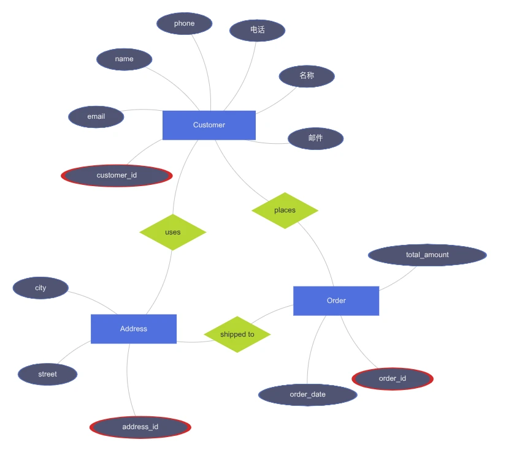

[English](README.md)

# Chen ER（ECharts 版）

一个将简洁的 ER DSL 文本解析并渲染为经典 Chen ER 图的前端包，使用 Peggy 生成解析器、ECharts 进行自动布局与可视化。




## 功能
- 解析 ER 文本：实体、属性、关系（含基数）
- 经典 Chen 样式：实体=矩形、关系=菱形、属性=椭圆
- 自动布局：ECharts `graph` 的力导向布局（可漫游/拖动）
- 轻依赖：仅 `echarts` 与 `peggy`，Vite 构建为库（ES/UMD）
 - 悬停提示信息：
   - 悬停关系：显示关系名、参与实体（A:B）、基数（如 1:N）
   - 悬停实体：以 OOP 风格显示类名与属性列表（主键属性以 `*` 标注）

## 安装
```bash
bun add chen-er
# 或
npm i chen-er
```

如果你在本仓库开发：
```bash
bun run pg      # 生成解析器 grammar/peggy/all-parser.js（ESM）
bun run dev     # 本地演示
bun run build   # 构建输出位于 dist：index.js / index.umd.js；类型声明位于 dist/types/index.d.ts
```

## 使用

### ES 模块
```ts
// 命名导出
import { chenERRbyClass, chenERRbyId } from 'chen-er'
// 渲染所有 class 为 'chenER' 的容器
chenERRbyClass('chenER')
// 通过 id 渲染单个容器
chenERRbyId('my-er-container')

// 默认导出（对象，内含方法）
import ChenER from 'chen-er'
ChenER.chenERRbyClass('chenER')
ChenER.chenERRbyId('my-er-container')
```

### CDN（ES 模块，自包含）
```html
<script type="module">
  import { chenERRbyClass, chenERRbyId } from 'https://cdn.jsdelivr.net/npm/chen-er@latest/dist/index.ems.js'
  chenERRbyClass('chenER')
  // chenERRbyId('my-er-container')
</script>
```

### UMD（jsDelivr，自包含）
```html
<script src="https://cdn.jsdelivr.net/npm/chen-er@latest/dist/index.umd.js"></script>
<script>
  ChenER.chenERRbyClass('chenER')
  // ChenER.chenERRbyId('my-er-container')
</script>
```
说明：UMD 全局对象名为 `ChenER`，包含 `chenERRbyClass` 与 `chenERRbyId` 方法。

### 在线试用
- 在 CodeSandbox 直接试用：https://codesandbox.io/p/sandbox/m248ws

### 语法规则摘要
- 注释：`# ...`（单行注释）
- 空白：空格/制表符/换行均可分隔元素
- 标识符：支持 Unicode 字母与数字，示例 `名称`、`email`
- 实体：
  - 形式：`entity <名称> { <字段行>... }`
  - 字段行：`<字段名> [PK]`（可选 `PK` 表示主键）
- 关系：
  - 形式：`rel <实体A> -- <实体B> : (<基数>) "<关系名>"`
  - 基数：`1:1`、`1:n`、`m:n` 等文本

## ER 文本示例
```
entity Customer {
  customer_id PK
  name
  email
}

entity Order {
  order_id PK
  order_date
}

rel Customer -- Order : (1:n) "places"
```


## API
- `chenERRbyClass(erTag?: string): void`
  - `erTag`：容器的 class 名称；默认 `"chenER"`
  - 读取每个匹配容器中的文本，解析并渲染 ECharts 图
- `chenERRbyId(id: string): void`
  - 通过容器 `id` 渲染单个图
- 默认导出：`{ chenERRbyClass, chenERRbyId }`

## 构建与发布
 - 使用 Vite 库模式构建；输出：
   - `dist/index.js`（ES，外部化依赖，供打包器使用）
   - `dist/index.ems.js`（ESM，自包含，适合 CDN 引入）
   - `dist/index.umd.js`（UMD，自包含，适合 CDN 引入）
 - 类型声明入口：`dist/types/index.d.ts`
 - `package.json` 的 `files: ["dist", "LICENSE"]` 仅发布构建产物与许可证。

## 使用限制与注意
 - 解析器由 Peggy 生成（ESM），需在构建时执行 `bun run pg`。
 - 浏览器端仅需库文件与 `echarts`，无需 `.peggy` 源。
 - 容器文本支持中文及注释（行首 `#` 注释、Unicode 标识符）。

## 约束与注意
- 解析器由 Peggy 生成（ESM），需在构建时执行 `bun run pg`。
- 浏览器端仅需库文件与 `echarts`，无需 `.peggy` 源。
- 若容器文本包含中文及注释，解析器已支持（行首 `#` 注释、Unicode 标识符）。

---
如需：增加 ELK 分层布局、属性多值/派生属性符号、关系基数标注规则，请在 Issue 中告知需求。
